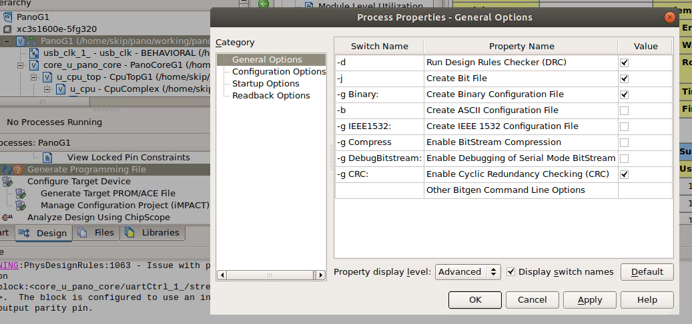
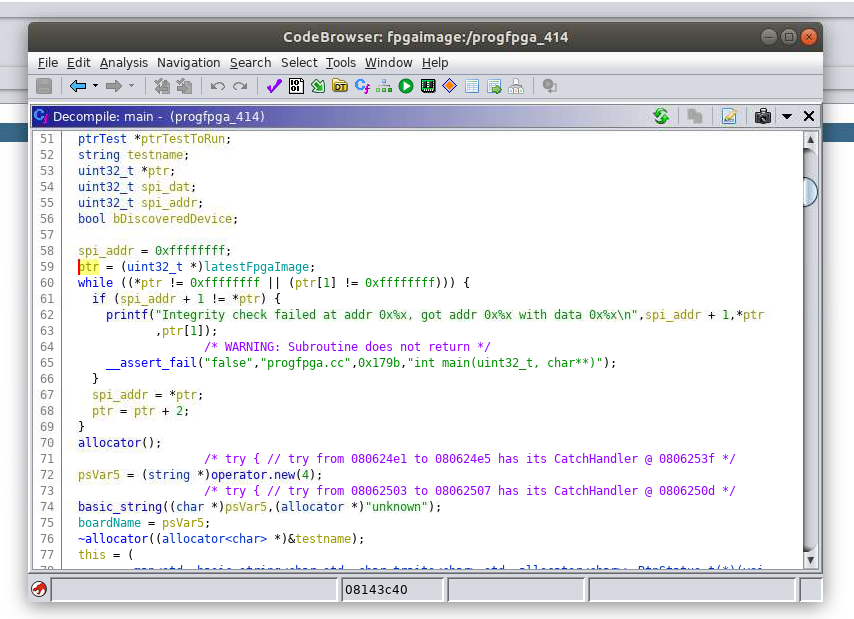
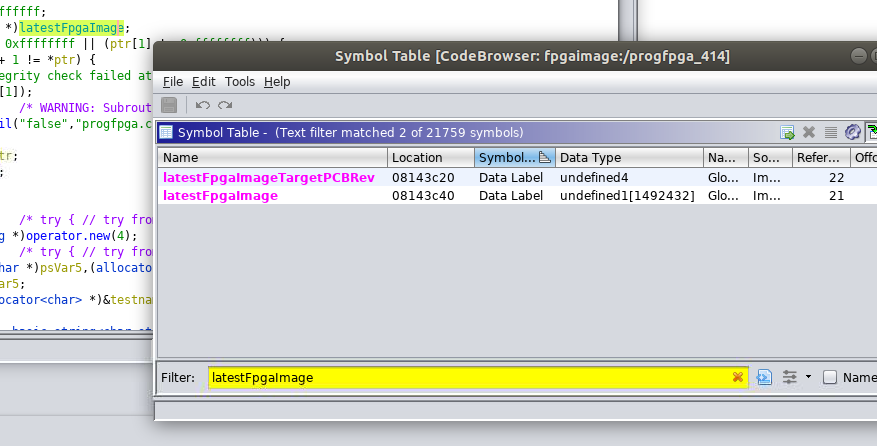

**If you have a G2 you might want to checkout my [panog2_ldr](https://github.com/skiphansen/panog2_ldr)
project before reading on.**

## Flashing Pano Logic devices without a programmer

This project updates the Xilinx image embedded in the Panologic's progfpga 
programmer utility with a new user provided image.

Why?

Using a JTAG or SPI programmer to update the flash in a Pano requires an 
investment in a programmer and requires disassembling the Pano to gain 
access to the programming connectors.  Sometimes a more convenient method 
is handy.

If you are one of those that picked up a Pano but never got around to 
doing anything with it now is your chance.  Dig your Pano out of your 
garage, checkout [Tom's Raytracer](https://github.com/tomverbeure/rt/commit/b232bf83a0fc9cb548fe35ba90f26d92d998c125), or my [pano_man](https://github.com/skiphansen/pano_man) or one of the 
other pano projects and give it a try.  

While a JTAG programmer is certainly a requirement for development 
progfpga provides a fast and easy way to load your latest creation on to a 
Pano device for whatever reason.  

**Warning:** No known images other than the original Pano Logic image 
implement Pano's protocol so this is a one way update unless you
install an image such as [panog2_ldr](https://github.com/skiphansen/panog2_ldr) 
which supports future updates or use a JTAG programmer.

## What is a Pano Logic device and why do I care?

Pano Logic was a Bay Area startup that manufactured tiny thin clients that 
were connected to a central server.  The Pano devices have a Ethernet 
interface, a few USB ports, audio input and output ports, and one or two 
video ports.  

The first generation (G1) Pano was based on the largest Xilinx Spartan-3E 
family chip and supported a single VGA monitor.  

The second generation (G2) supported two DVI monitors.  Revision A and B 
of the G2 devices were based on the Spartan-6 LX150 which is the largest 
chip in the family.  The revision C G2 device is based on the smaller 
LX100 device which is still quite large by hobbist standards.  

Unfortunately for Pano Logic, but fortunate for FPGA hobbists Pano Logic 
when out of business in 2012.  Shortly thereafter **TONS** of both new and 
used Pano Logic devices started showing up on ebay for very little money 
since they were pretty much useless without support.  Even today (April 
2019) both versions of the Pano Logic devices are still readily available 
on ebay for little.  

Tom Verbeure has spent a lot of time reverse engineering the Pano Logic 
devices and created a absolute mind blowing raytracing demo that runs on a 
G1 device.  It was the [Hackaday article](https://hackaday.com/2018/12/07/racing-the-beam-on-a-thin-client-in-fpgas/) article on his project that originally 
attracted my attention to the Pano hacking scene.  

Tom's article also got the attention of Wenting Zhang who added support 
for the G1's SDRAM and USB controller as well as making it possible to 
execute code on a soft processor directly from the SPI flash.  I can't 
wait until he finishes porting his [Verilog Boy](https://hackaday.io/project/57660-verilogboy-gameboy-on-fpga) project to the Pano.  

## Progfpga requirements 

Progfpga is a 32 bit Linux x86 program that can be run on any OS that can 
run 32 bit Linux binaries.  The Pano provided VM is fine if you don't mind 
a 4.4 gigabyte download that expands to 14 gigabytes when imported.  

I copied the progfpga command utility to my 64 bit Ubuntu 18.04 system and 
had no problems running it after I installed [32 bit 
libraries](https://linuxconfig.org/unable-to-find-a-suitable-destination-to-install-32-bit-compatibility-libraries-on-ubuntu-18-04-bionic-beaver-linux).  

The orignal Pano progfpga utility is provided in this repository to save 
you the hassle of downloading the VM.  Surprisingly no copyright notices 
appears in any of the source code or utilities in the Pano VM, nor is 
there a click though license agreement.  

If you want to go the VM route start [here](https://www.youtube.com/watch?v=DPkF5EisGDQ), or create a 32 bit Linux VM of your choice.  

## Preparing a binary image
We need a **BINARY** fpaga image (not a .bit file) for progfpga.  One can 
be created at the same time as the .bit file by checking the *Create 
Binary Configuration File* option in process properties the for the 
Generate Programming File process.  



After running the *Generate Programming File* process a .bin file should 
be created in the same subdirectory as the .bit file.  

## Flashing a G1 or G2 device

Please refer to the [Series1](Series1.md) and [Series2](Series2.md) files for
series specific progamming instructions.


## Background 

When Pano Logic was still alive they published a number of help videos on 
youtube including [this video](https://www.youtube.com/watch?v=DPkF5EisGDQ) which describes the FPGA image update process.  
The 21 minute video directs one to a CentOS 4.5 Linux P2V virtual machine which amazingly was 
still downloadable in 2019 from 
[here](https://www.youtube.com/redirect?q=https%3A%2F%2Fdocs.google.com%2Ffile%2Fd%2F0B9fxMMbyahDFS3h6QnJWak9xTEE%2Fedit%3Fusp%3Dsharing&event=video_description&v=DPkF5EisGDQ&redir_token=KhUbBOXL2w_m-aFI04GCf7ckh4l8MTU1NTI3MjQxNEAxNTU1MTg2MDE0).  

When I downloaded and ran the VM I found a treasure load of information on 
the Pano as well as the update utilities described in the video.  I even 
found some [**source code!**](./archaeology).  Apparently the VM was 
created from a system that has been used for developing code to burn-in 
and test Pano devices.  

Following the directions in the video I had no problem updating one of my 
Pano G1 devices, to the "current" Pano Logic firmware, but that wasn't my 
goal, I wanted to flash my own firmware.  

My hope when I downloaded the VM was that the flash utility updated the 
Pano using a .bit file from somewhere, but I had no luck finding one.  

Since I had been wanting to play with the NSA's 
[Ghidra](https://ghidra-sre.org/) reverse engineering tool anyway the Pano 
Logic flash update tool provided a perfect excuse.  

Once I watched the introductory video to help me learn the slightly 
non-intuitive UI it didn't take long to find where the image was coming 
from.  It's embedded in the application in a somewhat odd format.  

 

The memory address of latestFpgaImage is found in the Symbol Table window.



I couldn't figure out how to get Ghidra to tell me where latestFpgaImage 
was located in the program file but that information is easily available 
from objdump: 

```
skip@dell-790:~/pano/working/pano_progfpga$ objdump -h progfpga | grep "\.data
 24 .data         001796d4  08143c00  08143c00  000fbc00  2**5*
```

Knowing this we can calculate that we need to patch offset 0x8143c40 - 
0x08143c00 + 0x000fbc00 in the program file.  

All that remained was writing a program to update the updater with a new image.

## Pano Links

Link to other Panologic information can be found [here](https://github.com/tomverbeure/panologic-g2/wiki/Panologic-links#pano-links)

## Notes

1. This project has been featured on [Hackaday](https://hackaday.com/2019/04/19/pano-logic-fgpa-hacking-just-got-easier) ! 
2. If you build/use/modify this project I'd enjoy hearing about it.  You 
can find my email address in the git log.  


